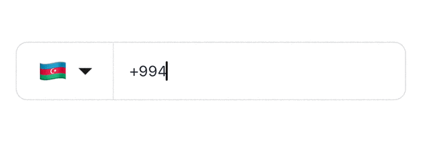
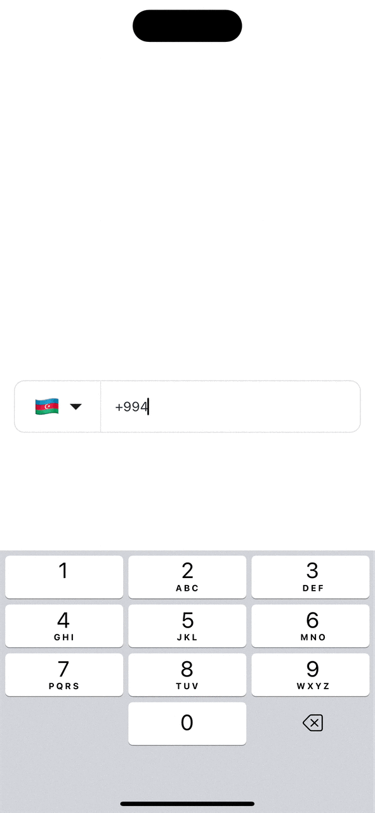

# react-native-phone-entry

<!-- [](https://badge.fury.io/js/react-native-phone-entry)
[]()
[](https://github.com/anday013/react-native-phone-entry/blob/main/LICENSE) -->

`react-native-phone-entry` is a simple and fully modifiable Phone Number Input Component for React Native that provides an intuitive interface for entering and validating international phone numbers. It includes country code selection, number formatting, and validation features.

<!-- {width=33%} {width=33%} {width=33%} -->

<!-- 
 -->

 <div align="center">
   <h3>Autopick Feature</h3>
   
   <p>A feature that automatically picks the right country while typing the phone number.</p>
   <h3>Masking Feature</h3>
   
   <p>A feature that picks a right mask based on the country code.</p>
 </div>
<!--  -->

## Features

- 🌍 International phone number input with country picker
- 📱 Automatic phone number formatting based on country
- 🔍 Dynamic country and mask adaptation based on typed country code
- ✨ Highly customizable appearance and styling
- 🎯 Phone number validation using Google's libphonenumber
- 🎨 Dark theme support
- ♿ Accessibility support
- 💪 Written in TypeScript

## Installation

```sh
npm install react-native-phone-entry

# or

yarn add react-native-phone-entry
```

## Usage

1. Import the PhoneInput component:

```jsx
import { PhoneInput, isValidNumber } from 'react-native-phone-entry';
```

2. Basic usage:

```jsx
export default function App() {
  const [countryCode, setCountryCode] = useState < CountryCode > 'AZ';
  return (
    <PhoneInput
      defaultValues={{
        countryCode: 'US',
        callingCode: '+1',
        phoneNumber: '',
      }}
      onChangeText={(text) =>
        console.log(
          'Phone number:',
          text,
          'isValidNumber:',
          isValidNumber(text, countryCode)
        )
      }
      onChangeCountry={(country) => {
        console.log('Country:', country);
        setCountryCode(country.cca2);
      }}
    />
  );
}
```

3. Advanced usage with customization:

```jsx
<PhoneInput
  defaultValues={{
    countryCode: 'US',
    callingCode: '+1',
    phoneNumber: '123456789',
  }}
  value="123456789"
  onChangeText={(text) => console.log('Phone number:', text)}
  onChangeCountry={(country) => console.log('Country:', country)}
  autoFocus={true}
  disabled={false}
  countryPickerProps={{
    withFilter: true,
    withFlag: true,
    withCountryNameButton: true,
  }}
  theme={{
    containerStyle: styles.phoneContainer,
    textInputStyle: styles.input,
    flagButtonStyle: styles.flagButton,
    codeTextStyle: styles.codeText,
    dropDownImageStyle: styles.dropDownImage,
    enableDarkTheme: false,
  }}
  hideDropdownIcon={false}
  isCallingCodeEditable={false}
/>
```

## Props

| Prop                    | Type                                                                                           | Description                                                     |
| ----------------------- | ---------------------------------------------------------------------------------------------- | --------------------------------------------------------------- |
| `defaultValues`         | `object`                                                                                       | Default values for country code, calling code, and phone number |
| `value`                 | `string`                                                                                       | Controlled value for the phone number input                     |
| `onChangeText`          | `(text: string) => void`                                                                       | Callback when phone number changes                              |
| `onChangeCountry`       | `(country: Country) => void`                                                                   | Callback when selected country changes                          |
| `autoFocus`             | `boolean`                                                                                      | Automatically focuses the input when mounted                    |
| `disabled`              | `boolean`                                                                                      | Disables the input                                              |
| `countryPickerProps`    | [`CountryPickerProps`](https://github.com/xcarpentier/react-native-country-picker-modal#props) | Props for the country picker modal                              |
| `maskInputProps`        | [`MaskInputProps`](https://github.com/CaioQuirinoMedeiros/react-native-mask-input#props)       | Props for the masked input component                            |
| `theme`                 | `Theme`                                                                                        | Theme configuration for styling the component                   |
| `hideDropdownIcon`      | `boolean`                                                                                      | Hides the dropdown arrow icon when set to true                  |
| `renderCustomDropdown`  | [`ReactNode`](https://react.dev/reference/react/Children)                                      | Custom component to replace the default dropdown arrow          |
| `flagProps`             | `object`                                                                                       | Props for customizing the country flag                          |
| `dropDownImageProps`    | [`ImageProps`](https://reactnative.dev/docs/image#props)                                       | Props for customizing the dropdown arrow image                  |
| `isCallingCodeEditable` | `boolean`                                                                                      | Controls whether the calling code can be edited                 |

### Theme Properties

| Property             | Type                                                                      | Description                          |
| -------------------- | ------------------------------------------------------------------------- | ------------------------------------ |
| `containerStyle`     | [`StyleProp<ViewStyle>`](https://reactnative.dev/docs/view-style-props)   | Style for the main container         |
| `textInputStyle`     | [`StyleProp<TextStyle>`](https://reactnative.dev/docs/text-style-props)   | Style for the text input             |
| `codeTextStyle`      | [`StyleProp<TextStyle>`](https://reactnative.dev/docs/text-style-props)   | Style for the calling code text      |
| `flagButtonStyle`    | [`StyleProp<ViewStyle>`](https://reactnative.dev/docs/view-style-props)   | Style for the flag button            |
| `dropDownImageStyle` | [`StyleProp<ImageStyle>`](https://reactnative.dev/docs/image-style-props) | Style for the dropdown arrow image   |
| `enableDarkTheme`    | `boolean`                                                                 | Enables dark theme for the component |

## Contributing

See the [contributing guide](CONTRIBUTING.md) to learn how to contribute to the repository and the development workflow.

## TODO

- [ ] Expose ref of the input
- [ ] Add custom country picker modal

## License

MIT

---

Made with [create-react-native-library](https://github.com/callstack/react-native-builder-bob)
